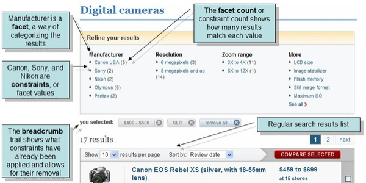
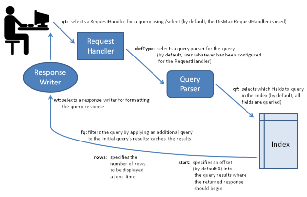

# 搜索概览

Solr 对搜索提供了丰富而灵活的特性集。
要理解这种灵活性的范围，从在 Solr 搜索中涉及的步骤和组件的一个概览开始会很有用。

当用户在 Solr 中运行一次搜索时，该搜索查询由一个 **请求处理器** 进行处理。
请求处理器是一个定义了当 Solr 处理一个请求时使用何种逻辑的 Solr 插件。
Solr 支持多种请求处理器。某些用于处理搜索查询，某些用于管理像索引复制这样的任务。

搜索应用默认会选择一个特定的请求处理器。
另外，应用可以被配置以允许用户在偏好其它请求处理器时可以覆盖这个默认选择。

要处理一个搜索请求，请求处理器会调用一个 **查询解析器**，它会解释查询中的词项和参数。
不同的查询解析器支持不同的语法。默认的查询解析器是 [DisMax 查询解析器](./query_syntax/dismax.md)。
Solr 也包含了一个早前的“标准”(Lucene) 查询解析器和一个 
[扩展的 DisMax 查询解析器](./query_syntax/extended_dismax.md)。
[标准查询解析器](./query_syntax/standard.md) 的语法允许在搜索中更大的精度，
但 DisMax 查询解析器具有更大的容错性。
DisMax 查询解析器设计用于提供类似于像 Google 这样流行的搜索引擎所提供的体验，
它们很少会给用户显示语法错误。
扩展的 DisMax 查询解析器是 DisMax 的改进版，
它能处理完整的 Lucene 查询语法同时依旧能容忍语法错误。
它也包含了多种额外的特性。

另外，[通用查询参数](./query_syntax/common.md) 可由所有的查询解析器所接受。

对查询解析器的输入可以包含：

* 搜索字符串 - 用于在索引中搜索的 *词项*
* *用作细粒度调整查询的参数* - 以提高特定字符串或字段的重要性，
主要通过对搜索词项间应用布尔逻辑或通过从搜索结果中排除内容。
* *用于控制查询响应表示的参数* - 如指定结果展示的排序或限制只响应搜索应用模式中特定的字段

查询参数也可以指定一个 **查询过滤器**。
作为搜索响应的一部分，查询过滤器可以在整个索引上运行并缓存其结果。
因为 Solr 对过滤器查询分配了独立的缓存，策略性地使用过滤器查询可以提高搜索性能。
(尽管名称类似，查询过滤器和分析过滤器没有关系。查询过滤器在搜索时对索引中已有的数据执行查询，
而分析过滤器，如 Tokenizers，以特定的规则在索引时解析内容。)

搜索查询可以情趣特定的词项在搜索响应中被高亮;即被搜索词项将在加色块中显示，
这样它们可以在搜索结果页面很容易找到。
[高亮](./highlight/readme.md) 可使得在返回的长文本中更容易找到相关段落。
Solr 支持多词项高亮。
Solr 也支持丰富的用于控制词项如何被高亮的搜索参数。

搜索响应也可被配置以包含 **snippets** （文档节选）来展示高亮的文本。
像 Google 和 Yahoo! 这样的流行的搜索引擎在其搜索结果中返回片段(3-4行的文本)来提供搜索结果的描述。

为帮助用户矫正他们所搜索的内容， Solr 提供了两种特殊的将搜索结果分组以提供更近一步浏览的方式：
faceting 和聚类。

[Faceting](./faceting.md) 是将搜索结果按分类 (它基于某个被索引的词项) 来进行排列。
在每个分类中， Solr 会报告相关词项的匹配数量，这称作一个 facet 约束。
Faceting 使得用户在浏览像电影网站和产品回顾网站这样的搜索结果时更加容易，
那些地方通常有很多的分类且每个分类中有很多项。

想像下面来自 CNET 网站的示例，它是第一个使用 Solr 的网站：

Faceting 利用了搜索应用所索引的某些字段。
上例中，这些字段包括了适用于描述数码相机的分类信息：厂商、分辨率和放大范围等。

**聚类** 在搜索执行时根据发现的相似度分组搜索结果，而不是在内容被索引时。
聚类的结果通常缺少像 faceted 搜索结果中那样的简洁的层级组织，
尽管如此聚类可以很有用。
它能揭示出搜索结果间意料之外的联系且能帮助用户排除和他们实际搜索不相关的内容。

Solr 也支持一个称为 [MoreLikeThis](./morelikethis.md) 的特性，
它让用户可以基于关注用户前一个查询中所返回的特定项来提交新的查询。
MoreLikeThis 查询可以利用 faceting 或聚类来给用户提供额外的帮助。

有个名为 [ResponseWriters](searching/response_writers.md) 的 Solr 组件
用于管理查询响应的最终表示。
Solr 包含了多中 ResponseWriters，包括
[XML Response Writer](https://cwiki.apache.org/confluence/display/solr/Response+Writers#ResponseWriters-TheStandardXMLResponseWriter)
和 [JSON Response Writer](https://cwiki.apache.org/confluence/display/solr/Response+Writers#ResponseWriters-JSONResponseWriter)。

下图展示了搜索过程中一些关键的元素。

